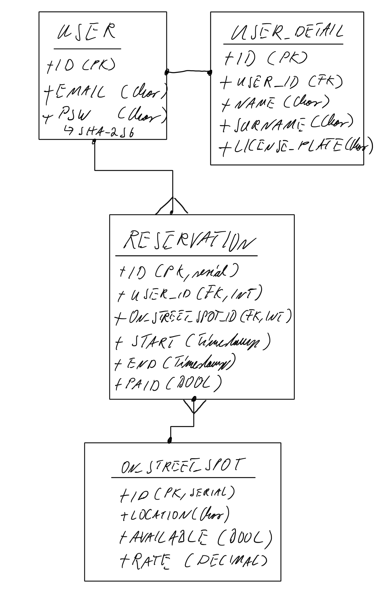

# Secure-My-Spot: Back-End

## \#TLDR
- This application offers a convenient way for users to locate, reserve, and pay for on-street 
  parking in New York City
- The app is a Dockerised Django / PostgreSQL back-end application
- The main resources are the User, Parking Spots, and Reservations, whereby there is a 1-to-Many 
  relationship between Users and Reservations and a 1-to-1 relationship between Reservations and 
  Parking Spots
- Polling of Django / PostgreSQL back-end ensures only available parking spots are displayed on 
  Google Map
- Users can pick an available parking spot and choose the length of the reservation period
- Custom in-app Stripe payments and processing flow, using setup intent and payment intent objects
- Reservation of parking spots is only confirmed upon successful completion of Stripe payment 
  processing whereby card details are collected for later charging
- Celery, RabbitMQ, and Redis are used to set up tasks that need to be executed at the end of 
  the reservation period 
- Users can change the reservation length or end a reservation at any time, either case results 
  in an email sent to the user to confirm any amendments to the reservation
- At the end of the reservation period the message broker pushes end-of-reservation tasks to 
  Celery for execution, including sending an end-of-reservation email to the user, changing the 
  state of the reserved parking spot resource from reserved to available in the PostgreSQL 
  backend, and using the Stripe setup intent and the customer's payment details to charge the 
  full amount
- Pytest has been used for unit testing / test-driven-development
- CD / CI pipeline is set up using GitHub workflows such that any branch that is pushed to 
  GitHub is automatically and fully tested and any successful pull requests or pushes into the 
  main branch are automatically deployed to Heroku

## Technologies used for the Front- and Back-End
| Technology               | Front-End | Back-End |
|:-------------------------|:---------:|:--------:|
| Axios                    |     x     |          |
| Black                    |           |    x     |
| Bootstrap                |     x     |          |
| Camelcase                |     x     |          |
| Celery                   |           |    x     |
| Coverage                 |     x     |    x     |
| Crypto.js                |     x     |          |
| CSS/SCSS                 |     x     |          |
| Docker                   |     x     |    x     |
| Django                   |           |    x     |
| Django Rest Framework    |           |    x     |
| Factory Boy              |           |    x     |
| Faker                    |     x     |    x     |
| Flake8                   |           |    x     |
| Google Maps Api          |     x     |          |
| Gunicorn                 |           |    x     |
| Heroku                   |           |    x     |
| HTML5                    |     x     |          |
| Husky                    |     x     |          |
| iSort                    |           |    x     |
| JavaScript               |     x     |          |
| Jest                     |     x     |          |
| Lodash                   |     x     |          |
| Logrocket                |     x     |          |
| Luxon                    |     x     |          |
| Model Bakery             |           |    x     |
| Moment                   |     x     |          |
| Nginx                    |     x     |          |
| Pipenv                   |           |    x     |
| PostgreSQL               |           |    x     |
| Pytest                   |           |    x     |
| Redis                    |           |    x     |
| React                    |     x     |          |
| React Router-Dom         |     x     |          |
| TypeScript               |     x     |          |
| Stripe Api               |     x     |    x     |
| Styled Components        |     x     |          |
| Whitenoise               |           |    x     |

## Set-up & Installation for Local Development
1. Clone this repo into your preferred local directory
2. Ensure pip, pipenv, and pyenv are installed locally (install pyenv with brew, pipenv with pip,
   and pip with `python -m ensurepip --upgrade`)
> Use the following links for more detail on how to install these packages: 
>- [pip](https://pip.pypa.io/en/stable/installation/)
>- [pipenv](https://pipenv.pypa.io/en/latest/index.html#install-pipenv-today)
>- [pyenv](https://github.com/pyenv/pyenv#homebrew-in-macos)
3. Run `pipenv install` in the project root directory to install all dependent packages
4. Install the Doppler CLI and authenticate according to these [instructions](https://docs.doppler.com/docs/install-cli)
5. Run the Doppler setup process in the root directory with `doppler setup`
6. Start the Postgres docker container with `doppler run -- docker-compose up -d --build`
7. Check containers are running normally by reviewing log statements with `docker logs [container_id]`
8. Run `pipenv shell` to initiate the environment
9. Ensure the database has all the tables setup by running `docker exec [db_container_id] python manage.py migrate`
10. Confirm there are no outstanding migrations with `docker exec [db_container_id] python manage.py showmigrations`
11. Open the browser to review the [SPA](http://localhost:3000) and the [API](http://localhost:3001)

## Systems Design Considerations
1. Data is mostly well-structured, factual, and numeric -> *relational db*
2. Data volume is limited (fixed number of parking spaces that can be booked across a finite 
   number of times per unit of time) -> *relational db*
3. Dependency on real time data processing (avoid double booking a parking spot) -> 
   *non-relational db*

### Conclusion
Given the limited booking volume and hence limited need for fast and reliable real-time 
processing of parking bay bookings a relational database management system is to be preferred. 
This project will use PostgreSQL, given the use of Django on the back-end and existing excellent 
support for PostgreSQL.

## Links
### Back-end
- [Deployed app](https://secure-my-spot-api.herokuapp.com/admin/)
- [Github repo](https://github.com/sven-gerlach/secure-my-spot-api)
- [Kanban](https://github.com/sven-gerlach/secure-my-spot-api/projects/1)
### Front-end
- [Deployed app](https://main.d105uookrugx2t.amplifyapp.com/)
- [Github repo](https://github.com/sven-gerlach/secure-my-spot-client)
- [Kanban](https://github.com/sven-gerlach/secure-my-spot-client/projects/1)

## Routes Summary
### User / Auth End-Points
| Verb   | URI        | Body        | Headers | Status Response | Response Body |
|:-------|:-----------|:------------|:--------|:----------------|:--------------|
| POST   | /sign-up   | Credentials | n/a     | 201, Created    | user details  |
| POST   | /sign-in   | Credentials | n/a     | 201             | token         |
| DELETE | /sign-out  | n/a         | Token   | 204             | n/a           |
| PATCH  | /change-pw | Credentials | Token   | 204             | n/a           |

### Parking Spot End-Points
| Verb | URI                             | Params                                   | Status Response | Response Body  |
|:-----|:--------------------------------|:-----------------------------------------|:----------------|:---------------|
| GET  | /available-parking-spots        | n/a                                      | 200             | parking spots  |
| GET  | /available-parking-spots-filter | ?lat=[?]&long=[?]&unit=[km/mil]&dist=[?] | 200             | parking spots  |

### Reservations End-Points
| Verb   | URI                                               | Body                      | Headers | Status Response | Response Body |
|:-------|:--------------------------------------------------|:--------------------------|:--------|:----------------|:--------------|
| GET    | /reservation-auth                                 | n/a                       | Token   | 200             | reservations  |
| GET    | /expired-reservations-auth                        | n/a                       | Token   | 200             | reservations  |
| GET    | /reservation-unauth:reservation_id/:email         | n/a                       | n/a     | 200             | reservation   |
| POST   | /reservation-auth/:parking_spot_id                | email, reservation length | Token   | 201             | reservation   |
| POST   | /reservation-unauth/:parking_spot_id              | email, reservation length | n/a     | 201             | reservation   |
| PATCH  | /update-reservation-auth/:reservation_id          | end_time                  | Token   | 200             | reservation   |
| PATCH  | /update-reservation-unauth/:reservation_id/:email | end_time                  |         | 200             | reservation   |
| DELETE | /delete-reservation-auth/:reservation_id          | n/a                       | Token   | 204             | n/a           |
| DELETE | /delete-reservation-unauth/:reservation_id/email  | n/a                       | Token   | 204             | n/a           |

### Payment End-Points
| Verb | URI                                                            | Body | Headers | Status Response | Response Body        |
|:-----|:---------------------------------------------------------------|:-----|:--------|:----------------|:---------------------|
| POST | /create-payment-intent-auth/:reservation_id                    | n/a  | Token   | 201             | Stripe client secret |
| POST | /create-payment-intent-unauth/:reservation_id/:email           | n/a  |         | 201             | Stripe client secret |
| GET  | /confirm-successful-setup-intent-auth/:reservation_id          | n/a  | Token   | 204             | n/a                  |
| GET  | /confirm-successful-setup-intent-unauth/:reservation_id/:email | n/a  |         | 204             | n/a                  |

## ERD

## Next Steps
- [ ] Replace polling of back-end with a websocket design that allows for bi-directional 
  communication between the front- and the back-end
- [ ] This could also be used to verify emails before users are allowed to create an account or 
  make a reservation (unauthenticated users)
- [ ] Renew tokens after [24h] automatically